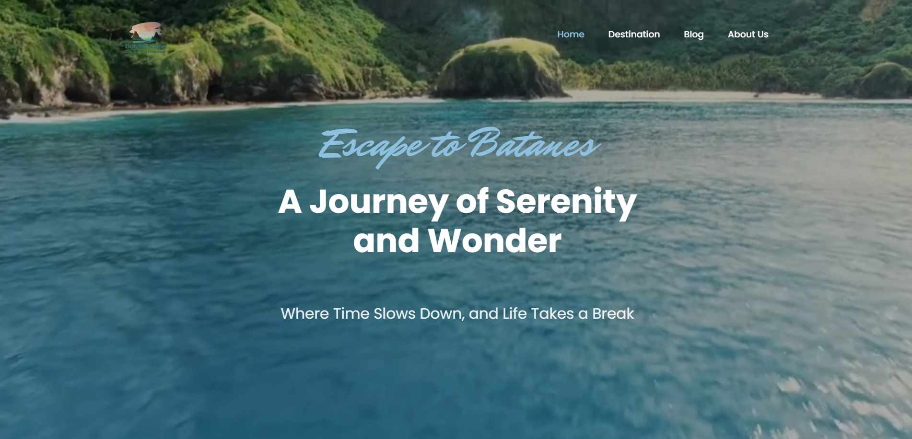

<h2 align='center'>BATANESCAPE</h2>

<b>Travel website about the breathtaking province of Batanes</b>

<h2>✨ Navigations</h2>

__Homepage__
An overview of the Province of Batanes, it's municipalities, heritage, about the Ivatans, and some frequently asked questions about the province.

__Destinations__
Included in this tab are some popular destinations around the province that tourists can visit. There is a travel guide that can serve as a sample itenerary for tourists.

__Blog__
There are linked articles and travel blogs that you can visit to have more information about traveling the province. Research is important when traveling so don't forget to check out this tab.

__About Us__
Meet the team! We are a group of 2nd Year Computer Engineering student and we did this website for our final project in Software Development project. 

<h2>📫 How to reach me:</h2>
Hit me up with some suggestions on how can I improve this website

  

<b>Thank you for visiting! May the force be with you ⚔️⭐</b>
